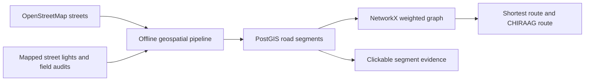
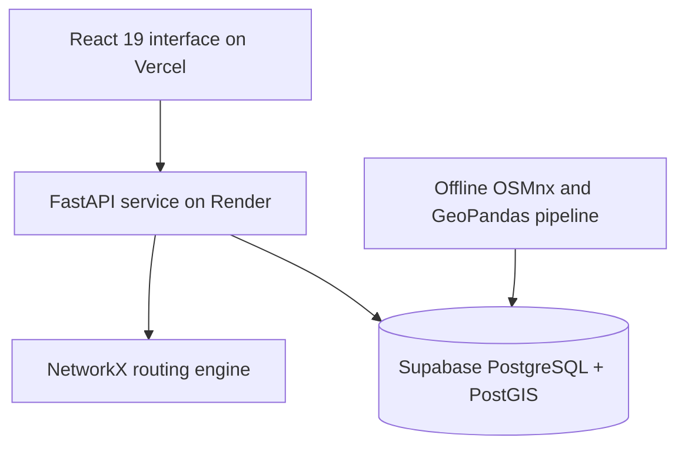

<div align="center">

# CHIRAAG

### Evidence-backed walking routes for people travelling after dark

[**Try the live prototype**](https://chiraag-1hbj.vercel.app/) · [**View the repository**](https://github.com/ShubhiDixit09/CHIRAAG)


**Team 0xPredators · Central Delhi pilot**

</div>

---

## The problem

Most navigation systems optimise distance and travel time. After dark, the shortest path may also carry the greatest exposure to unlit streets.

CHIRAAG compares the normal shortest route with a lower-exposure alternative and keeps that alternative inside a detour limit chosen by the user. It also exposes the evidence behind each road segment instead of presenting an unexplained safety score.

It is designed for anyone who regularly moves through the city at night, including night-shift workers, delivery partners, students, women and late-night commuters.

> **Current demo result:** 245 m of unlit road avoided for 68 m of additional walking.

## What CHIRAAG does

- Shows the **shortest route** and the **CHIRAAG route** together on the map.
- Measures **unlit metres** and the **longest continuous dark gap**, rather than relying on lamp counts alone.
- Lets the user set the **time of day** and a **maximum detour budget**.
- Keeps **observed darkness** separate from **missing evidence**.
- Marks unsurveyed stretches as unknown instead of silently calling them safe.
- Makes road segments clickable so users can inspect `dark_fraction`, `longest_gap_m` and `observation_state`.
- Accepts ground-truth night audits that override inferred lighting values.

## Five core differentiators

| Differentiator | Why it matters |
|---|---|
| **Unlit metres, not lamp counts** | Evenly spaced lights and clustered lights create very different walking conditions. CHIRAAG measures the road actually left uncovered. |
| **Dark is different from unknown** | A surveyed dark street and an unsurveyed street are shown and handled differently. |
| **Safety within a detour budget** | The router lowers exposure without sending the user on an impractically long walk. |
| **Inspectable route evidence** | Every coloured road segment can be traced back to its lighting metrics and observation state. |
| **Night-audit calibration** | Human observations can correct machine-derived estimates and take priority on the next route request. |

## Verified pilot results

The evaluation used **50 randomly selected journeys**, each 500 m to 2.5 km apart, routed at 23:00 through the deployed engine.

| Metric | Result |
|---|---:|
| Journeys tested | **50** |
| Journeys with a lower-exposure alternative | **36 of 50 (72%)** |
| Journeys where the shortest route was already least exposed | **14 of 50 (28%)** |
| Median unlit street avoided | **136 m** |
| Median additional walking | **28 m** |
| Dark street avoided per extra metre walked | **4.9 : 1** |
| Maximum permitted detour | **20%** |

These are aggregate test results. The 245 m and 68 m figures shown above are the selected demo journey, not the median journey.

## Evidence coverage

| Evidence item | Current pilot |
|---|---:|
| Walkable road segments | **3,970** |
| Human-audited segments | **22** |
| Evidence-scored segments | **2,206** |
| Segments carrying lighting evidence | **2,228 (56.1%)** |
| Segments not yet surveyed | **1,742** |
| Street lights ingested | **7,120** |
| Human audit records | **28** |
| Routable coverage area | **11.42 km²** |
| Unlit share of surveyed street | **24.6%** |
| Spatial projection used for measurement | **EPSG:32643 (UTM 43N)** |

## How it works



### 1. Build the street network

OSMnx downloads walkable OpenStreetMap geometry. GeoPandas and Shapely process the network in metres using EPSG:32643.

### 2. Attach lighting evidence

Mapped street lights are associated with roads within 25 m. Each light is treated as covering a 25 m interval on either side. Overlapping intervals are merged before calculating:

- `dark_fraction`: the share of the segment estimated to be unlit
- `longest_gap_m`: the longest continuous uncovered stretch
- `observation_state`: whether the segment is audited, evidence-scored or unobserved

### 3. Route over exposure

For an observed road segment:

```text
route cost = length + λ × dark_fraction × length
```

NetworkX runs Dijkstra on this weighted graph. The normal shortest route uses distance only. The CHIRAAG route adds an exposure penalty, then accepts the result only when it remains inside the user's detour cap `α`.

Time changes how strongly the router penalises darkness:

| Local time | Weighting factor |
|---|---:|
| 06:00 to 18:59 | `1.00×` |
| 19:00 to 21:59 | `1.15×` |
| 22:00 to 05:59 | `1.30×` |

The time factor affects routing decisions. It does not rewrite the stored street evidence.

### 4. Handle missing evidence honestly

CHIRAAG offers four user-facing treatments for streets with no lighting data:

| Policy | Behaviour |
|---|---|
| `avoid` | Heavily penalises unsurveyed streets and uses them only when necessary. |
| `neutral` | Uses distance alone and makes no lighting assumption. |
| `assume_typical` | Applies the measured network prior of 25% unlit. |
| `show_gaps` | Maintained as a compatibility alias for neutral while the interface highlights evidence gaps. |

Unknown distance remains separate from measured unlit distance in route metrics and safety claims.

## System architecture



The ingestion pipeline performs expensive geospatial work in advance. The request-time API reads precomputed segment scores from PostGIS and builds the routing graph for the requested area.

## Technology stack

| Layer | Technologies |
|---|---|
| Frontend | React 19, Vite, MapLibre GL, MapTiler, Turf.js |
| API | FastAPI, Uvicorn, Pydantic |
| Routing | NetworkX, weighted Dijkstra |
| Database | PostgreSQL, PostGIS, SQLAlchemy, GeoAlchemy2 |
| Pipeline | Python, OSMnx, GeoPandas, Shapely, pandas, NumPy |
| Calibration | scikit-learn and human night-audit overrides |
| Deployment | Vercel, Render, Supabase, Docker |

## Repository structure

```text
CHIRAAG/
├── chiraag_frontend/
│   ├── public/
│   └── src/
│       ├── components/
│       ├── fixtures/
│       ├── lib/
│       └── styles/
├── igdtw_backend/
│   ├── app/
│   │   ├── models/
│   │   ├── routers/
│   │   ├── schemas/
│   │   └── services/
│   ├── pipeline/
│   ├── scripts/
│   ├── tests/
│   ├── chiraag_data.sql
│   └── docker-compose.yml
└── README.md
```

## Run locally

### Prerequisites

- Docker Desktop
- Node.js 18 or newer
- A MapTiler API key for the live basemap and place search
- A Mapillary access token only when ingesting fresh street-light data

### 1. Clone the repository

```bash
git clone https://github.com/ShubhiDixit09/CHIRAAG.git
cd CHIRAAG
```

### 2. Start the API and PostGIS

```bash
cd igdtw_backend
docker compose up -d --build
```

This starts:

- API: `http://localhost:8000`
- Swagger documentation: `http://localhost:8000/docs`
- PostGIS: `localhost:5434`

Check the API:

```bash
curl http://localhost:8000
```

### 3. Restore the included pilot dataset

Run these commands from `igdtw_backend`:

```bash
docker compose cp chiraag_data.sql db:/tmp/chiraag_data.sql
docker compose exec db psql -U chiraag -d chiraag -f /tmp/chiraag_data.sql
```

Verify the loaded segment states:

```bash
docker compose exec db psql -U chiraag -d chiraag -c \
  "SELECT observation_state, count(*) FROM road_segments GROUP BY 1;"
```

### 4. Configure and start the frontend

Open a second terminal:

```bash
cd CHIRAAG/chiraag_frontend
npm install
```

Create `chiraag_frontend/.env`:

```env
VITE_USE_MOCK_DATA=false
VITE_API_URL=http://localhost:8000
VITE_MAPTILER_KEY=your_maptiler_key
```

Start Vite:

```bash
npm run dev
```

Open `http://localhost:5173`.

> PowerShell may block `npm.ps1`. If that happens, use `npm.cmd install` and `npm.cmd run dev`.

### 5. Run the backend tests

```bash
cd igdtw_backend
docker compose exec api python -m pytest tests/ -q
```

## API example

### Route request

```http
POST /api/v1/route
Content-Type: application/json
```

```json
{
  "origin": { "lat": 28.612945, "lon": 77.229466 },
  "destination": { "lat": 28.631540, "lon": 77.216742 },
  "alpha": 1.20,
  "unknown_policy": "assume_typical",
  "hour": 23
}
```

The response returns the baseline route, CHIRAAG route, per-segment evidence, coverage ratios, unlit metres avoided and additional walking distance.

### Segment evidence

```http
GET /api/v1/evidence/segment/{segment_id}
```

### Submit a night audit

```http
POST /api/v1/evidence/audit
Content-Type: application/json
```

```json
{
  "road_segment_id": 489,
  "rating": 2.0,
  "observed_light_count": 3
}
```

Ratings use a 0 to 5 scale, where 0 means pitch dark and 5 means well lit. Multiple audits are averaged, and audited values override imagery-derived estimates.

## Current limitations

- The current pilot covers **11.42 km²** in central Delhi, not the whole city.
- **43.9%** of road segments remain unsurveyed and are shown as unknown.
- The 25 m light radius is a modelling assumption, not a measurement of lamp output, height or road width.
- Street-light proximity does not directly measure brightness, maintenance status, pedestrian activity or crime risk.
- Light attribution is harder on divided roads, medians and service lanes.
- CHIRAAG lowers measured lighting exposure. It does not guarantee personal safety.

## Next steps

- Ingest Mapillary image coverage separately from light detections so an imaged road with no visible lamps can be distinguished from a road with no imagery.
- Improve light-to-road attribution on divided roads and service lanes.
- Expand structured night audits and publish coverage quality by area.
- Replace the fixed light radius with context from lamp type, road width and mounting height where data is available.

## Data attribution

- Street geometry: [OpenStreetMap](https://www.openstreetmap.org/) via OSMnx, licensed under ODbL
- Street-light features: [Mapillary](https://www.mapillary.com/)
- Basemap and geocoding: [MapTiler](https://www.maptiler.com/)

---

<div align="center">

Built by **Team 0xPredators** for the Smart India Hackathon.

</div>
